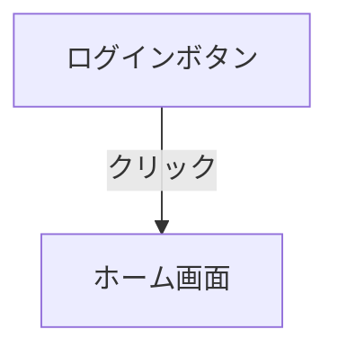

# Figma Flow Extractor

Figmaのプロトタイプ情報（インタラクション、画面遷移、アニメーション）を抽出し、AIに渡せる形式で提供するプラグイン＆MCPサーバーです。

## 機能

### 抽出できる情報

- **インタラクション情報**
  - トリガー（クリック、ホバー、プレス、ドラッグなど）
  - アクションタイプ（画面遷移、オーバーレイ、スワップなど）
  - 遷移先ノード

- **トランジション情報**
  - アニメーションタイプ（Smart Animate、Dissolve など）
  - Duration（秒）
  - Easing設定

- **画面構造**
  - フレーム/コンポーネント一覧
  - サイズ情報
  - 階層構造

### 出力形式

- **JSON** - 構造化データとして
- **Markdown** - 読みやすいドキュメント形式
- **Mermaid** - フローチャート図として

## セットアップ

### 1. 依存関係のインストール

```bash
cd figma-mcp-flow
npm install
```

### 2. ビルド

```bash
npm run build
```

### 3. Figmaプラグインのインストール

1. Figma Desktop を開く
2. メニュー → Plugins → Development → Import plugin from manifest...
3. このプロジェクトの `manifest.json` を選択

### 4. サーバーの起動

```bash
npm run server
```

サーバーが `http://localhost:3846` で起動します。

## 使い方

### Figmaプラグイン

1. Figmaでプロジェクトを開く
2. Plugins → Development → Flow Extractor を起動
3. 「ページ全体を抽出」または「選択範囲を抽出」をクリック
4. 結果がMarkdown/JSON/Mermaid形式で表示される
5. 「サーバーに送信」でMCPサーバーにデータを送信

### MCPサーバーとの連携

サーバーは以下のエンドポイントを提供します：

| エンドポイント | メソッド | 説明 |
|---------------|---------|------|
| `/health` | GET | ヘルスチェック |
| `/flow-data` | GET | 利用可能なフローデータ一覧 |
| `/flow-data/latest` | GET | 最新のフローデータ取得 |
| `/flow-data` | POST | フローデータを受信 |
| `/mcp` | GET | MCPサーバー情報 |
| `/mcp/tools/:name` | POST | MCPツール実行 |

### Cursor MCP設定

`~/.cursor/mcp.json` に以下を追加：

```json
{
  "mcpServers": {
    "Figma Desktop": {
      "url": "http://127.0.0.1:3845/mcp"
    },
    "Figma Flow Extractor": {
      "url": "http://127.0.0.1:3846/mcp"
    }
  }
}
```

## MCPツール

### `get_flow_data`

最新の抽出フローデータを取得します。

パラメータ:
- `format`: 出力形式 (`json` | `markdown` | `mermaid`)

### `list_flows`

利用可能なすべてのフローデータを一覧表示します。

## 出力例

### Markdown形式

```markdown
# MyProject - MainPage

## 画面一覧 (5画面)

### ログイン画面
- ID: `123:456`
- タイプ: FRAME
- サイズ: 375 x 812

#### インタラクション
- **ログインボタン** (INSTANCE)
  - トリガー: クリック
  - アクション: 画面遷移
    - 遷移先: ホーム画面
    - トランジション: SMART_ANIMATE (0.3s)

## 画面遷移フロー

| 遷移元 | トリガー | アクション | 遷移先 | トランジション |
|--------|----------|------------|--------|----------------|
| ログインボタン | クリック | 画面遷移 | ホーム画面 | SMART_ANIMATE |
```

### Mermaid形式



## 開発

### ファイル構造

```
figma-mcp-flow/
├── manifest.json          # Figmaプラグイン設定
├── package.json
├── tsconfig.json          # プラグイン用TypeScript設定
├── tsconfig.server.json   # サーバー用TypeScript設定
├── src/
│   ├── plugin/
│   │   ├── code.ts        # プラグインメインコード
│   │   └── ui.html        # プラグインUI
│   └── server/
│       └── index.ts       # MCPサーバー
└── dist/                  # ビルド出力
```

### 開発モード

プラグインとサーバーを同時に開発モードで起動：

```bash
npm run dev
```

## ライセンス

MIT
