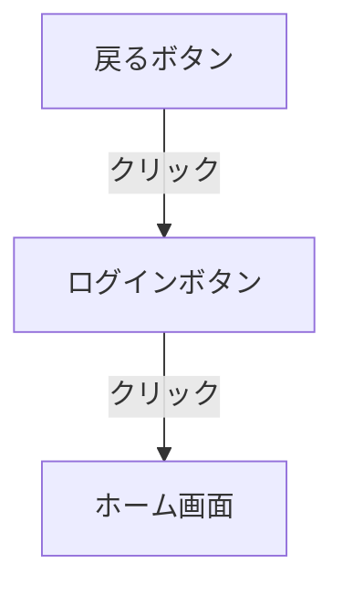

# Figma Flow Extractor

Figmaのプロトタイプ情報（インタラクション、画面遷移、アニメーション）を抽出し、AIに渡せる形式で提供するFigmaプラグイン＆MCPサーバーです。

## 背景・なぜ必要か

### Figma MCP（公式）の限界

Figma公式のMCPサーバー（`localhost:3845`）は以下のツールを提供しています：

| ツール               | 取得できる情報             |
| -------------------- | -------------------------- |
| `get_metadata`       | レイヤー構造、位置、サイズ |
| `get_design_context` | デザイン詳細、スタイル     |
| `get_screenshot`     | スクリーンショット画像     |

**しかし、プロトタイプのインタラクション情報（どのボタンがどの画面に遷移するか）は取得できません。**

### 解決策

Figma Plugin APIの `node.reactions` プロパティを使えば、インタラクション情報を取得できます。
このプロジェクトは：

1. **Figmaプラグイン** でインタラクション情報を抽出
2. **MCPサーバー** でAIに提供

という構成で、この問題を解決します。

---

## MCPとは（Model Context Protocol）

### 概要

MCPは **AIが外部ツール・データにアクセスするための標準規格** です。

```
┌─────────────────┐                    ┌─────────────────┐
│                 │   「〇〇を調べて」   │                 │
│   AI (Claude)   │ ─────────────────► │   MCP Server    │
│                 │                    │   (ツール提供者)  │
│                 │ ◄───────────────── │                 │
│                 │   「結果はこれです」  │                 │
└─────────────────┘                    └─────────────────┘
```

### MCPの登場人物

| 役割         | 説明                       | 例                              |
| ------------ | -------------------------- | ------------------------------- |
| **Client**   | AIが動いている環境         | Cursor, Claude Desktop          |
| **Server**   | ツールを提供するプログラム | Figma MCP, GitHub MCP           |
| **Resource** | 実際のデータ・サービス     | Figmaファイル, GitHubリポジトリ |

### 通信の流れ

```
① Cursor起動
     │
     ▼
② mcp.json を読み、各MCPサーバーに接続
     │
     ▼
③ tools/list でツール一覧を取得し、AIに登録
     │
─────────── ユーザーが質問 ───────────
     │
     ▼
④ AIが「このツールを使おう」と判断
     │
     ▼
⑤ Cursorが tools/call でMCPサーバーにリクエスト
     │
     ▼
⑥ 結果をAIに渡す → AIが回答を生成
```

---

## アーキテクチャ

このプロジェクトでは2つのアプローチを提供しています。

### アプローチA: 独立サーバー（推奨）

```
┌─────────────────────────────────────────────────────────────────┐
│                          Cursor                                 │
│                            │                                    │
│              ┌─────────────┴─────────────┐                     │
│              ▼                           ▼                     │
│   ┌──────────────────┐        ┌──────────────────┐            │
│   │ Figma MCP (公式)  │        │ Flow Server      │            │
│   │ localhost:3845   │        │ localhost:3846   │            │
│   ├──────────────────┤        ├──────────────────┤            │
│   │ get_metadata     │        │ get_flow_data    │            │
│   │ get_design_context│       │ list_flows       │            │
│   │ get_screenshot   │        │                  │            │
│   └──────────────────┘        └────────▲─────────┘            │
│                                        │                       │
│                               POST /flow-data                  │
│                                        │                       │
│                               ┌────────┴─────────┐            │
│                               │  Figma Plugin    │            │
│                               │  (Flow Extractor)│            │
│                               └──────────────────┘            │
└─────────────────────────────────────────────────────────────────┘
```

**メリット：**

- シンプルで独立動作
- デバッグが容易
- 公式MCPの更新に影響されない

### アプローチB: ラッパーサーバー

```
┌─────────────────────────────────────────────────────────────────┐
│                          Cursor                                 │
│                            │                                    │
│                            ▼                                    │
│              ┌──────────────────────────┐                      │
│              │   Wrapper MCP Server     │                      │
│              │   localhost:3847         │                      │
│              ├──────────────────────────┤                      │
│              │ 独自ツール:               │                      │
│              │  - get_flows            │◄── Figma Plugin      │
│              │  - get_full_context     │    からデータ受信     │
│              │                          │                      │
│              │ プロキシ:                 │                      │
│              │  - get_metadata    ─────┼──► Figma MCP (3845)  │
│              │  - get_design_context ──┼──►                   │
│              │  - get_screenshot  ─────┼──►                   │
│              └──────────────────────────┘                      │
└─────────────────────────────────────────────────────────────────┘
```

**メリット：**

- 1つのMCPサーバーとして見える
- `get_full_context` でデザイン＋フローを一括取得

---

## 抽出できる情報

### インタラクション情報

| 項目               | 説明                       | 例                               |
| ------------------ | -------------------------- | -------------------------------- |
| **トリガー**       | インタラクションの発火条件 | クリック、ホバー、ドラッグ       |
| **アクション**     | 実行される動作             | 画面遷移、オーバーレイ、スワップ |
| **遷移先**         | 遷移先のノードID・名前     | "ホーム画面"                     |
| **トランジション** | アニメーション設定         | Smart Animate, 0.3s              |

### 出力形式

- **JSON** - 構造化データとして
- **Markdown** - 読みやすいドキュメント形式
- **Mermaid** - フローチャート図として

---

## セットアップ

### 1. 依存関係のインストール

```bash
cd figma-mcp-flow
npm install
```

### 2. ビルド

```bash
npm run build
```

### 3. Figmaプラグインのインストール

1. Figma Desktop を開く
2. **Plugins → Development → Import plugin from manifest...**
3. このプロジェクトの `manifest.json` を選択

### 4. サーバーの起動

```bash
# 独立サーバー（アプローチA）
npm run server

# または ラッパーサーバー（アプローチB）
npm run server:wrapper
```

### 5. Cursor MCP設定

`~/.cursor/mcp.json` を編集：

**アプローチA（独立サーバー）の場合：**

```json
{
  "mcpServers": {
    "Figma Desktop": {
      "url": "http://127.0.0.1:3845/mcp"
    },
    "Figma Flow": {
      "url": "http://127.0.0.1:3846/mcp"
    }
  }
}
```

**アプローチB（ラッパー）の場合：**

```json
{
  "mcpServers": {
    "Figma Flow Wrapper": {
      "command": "npx",
      "args": ["ts-node", "/path/to/figma-mcp-flow/src/server/mcp-wrapper.ts"],
      "env": {
        "FIGMA_MCP_URL": "http://127.0.0.1:3845/sse",
        "HTTP_PORT": "3846"
      }
    }
  }
}
```

---

## 使い方

### Step 1: Figmaでプラグインを起動

1. Figmaでデザインファイルを開く
2. **Plugins → Development → Flow Extractor** を起動

### Step 2: フロー情報を抽出

1. 「**ページ全体を抽出**」または「**選択範囲を抽出**」をクリック
2. 結果がMarkdown/JSON/Mermaid形式で表示される

### Step 3: サーバーに送信

1. 「**サーバーに送信**」をクリック
2. データがMCPサーバーに保存される

### Step 4: CursorでAIに質問

```
ユーザー: 「この画面のフロー情報を教えて」

AI: get_flow_data ツールを使用します...

    # MyProject - MainPage

    ## Screen Transitions (3)

    | From | Trigger | Action | To | Transition |
    |------|---------|--------|----|-----------|
    | ログインボタン | クリック | 画面遷移 | ホーム画面 | SMART_ANIMATE |
    | ...
```

---

## APIエンドポイント

### 独立サーバー (localhost:3846)

| エンドポイント      | メソッド | 説明                                 |
| ------------------- | -------- | ------------------------------------ |
| `/health`           | GET      | ヘルスチェック                       |
| `/flow-data`        | GET      | 利用可能なフローデータ一覧           |
| `/flow-data/latest` | GET      | 最新のフローデータ取得               |
| `/flow-data`        | POST     | フローデータを受信（プラグインから） |
| `/mcp`              | GET      | MCPサーバー情報                      |
| `/mcp/tools/:name`  | POST     | MCPツール実行                        |

### MCPツール

| ツール名        | 説明                                                |
| --------------- | --------------------------------------------------- |
| `get_flow_data` | フローデータを取得（format: json/markdown/mermaid） |
| `list_flows`    | 利用可能なフローデータ一覧                          |

---

## 出力例

### Markdown形式

```markdown
# MyProject - MainPage

Extracted: 2024-01-15T10:30:00.000Z

## Screen Transitions (3)

| From             | Trigger  | Action           | To             | Transition    |
| ---------------- | -------- | ---------------- | -------------- | ------------- |
| ログインボタン   | クリック | 画面遷移         | ホーム画面     | SMART_ANIMATE |
| 戻るボタン       | クリック | 戻る             | -              | -             |
| メニューアイコン | クリック | オーバーレイ表示 | サイドメニュー | MOVE_IN       |
```

### Mermaid形式



---

## ファイル構造

```
figma-mcp-flow/
├── manifest.json           # Figmaプラグイン設定
├── package.json            # 依存関係・スクリプト
├── tsconfig.json           # プラグイン用TypeScript設定
├── tsconfig.server.json    # サーバー用TypeScript設定
├── src/
│   ├── plugin/
│   │   ├── code.ts         # プラグインメインコード
│   │   └── ui.html         # プラグインUI
│   ├── server/
│   │   ├── index.ts        # 独立MCPサーバー
│   │   └── mcp-wrapper.ts  # ラッパーMCPサーバー
│   └── types/
│       └── index.d.ts
└── dist/                   # ビルド出力
```

---

## 開発

### スクリプト

```bash
# プラグインのビルド
npm run build:plugin

# サーバーのビルド
npm run build:server

# 全てビルド
npm run build

# 開発モード（プラグイン監視 + サーバー起動）
npm run dev

# 独立サーバー起動
npm run server

# ラッパーサーバー起動
npm run server:wrapper
```

---

## トラブルシューティング

### プラグインがインストールできない

- Figma **Desktop** アプリを使用していることを確認
- ブラウザ版Figmaでは開発プラグインをインストールできません

### サーバーに送信できない

- サーバーが起動しているか確認: `curl http://localhost:3846/health`
- CORSエラーの場合、ブラウザコンソールを確認

### MCPサーバーがCursorに認識されない

- `~/.cursor/mcp.json` の構文を確認
- Cursorを再起動

---
